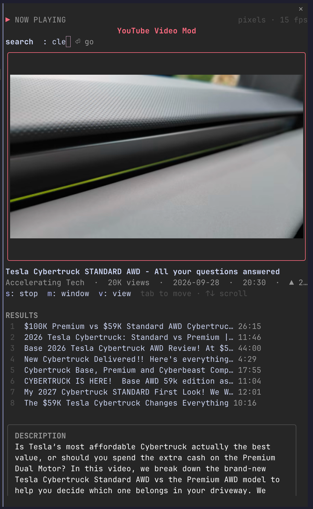

# YouTube Video Mod for Claude Code

Search YouTube and watch videos inside a Claude Code pane, with sound, without leaving the terminal.



## What it does

- **`/youtube <search>`** lists results. Pick one and it plays in the pane.
- **`/youtube <link>`** plays that video directly. It accepts `youtu.be`, `watch?v=`, `/shorts/`, `/embed/` and `/live/` links.
- **Real pixels or blocks.** Terminals that can show images (Ghostty, kitty, WezTerm) get real pixels. Others, such as Apple Terminal, get quadrant blocks: 2×2 pixels per character cell.
- **Picture and sound in sync.** One decoder runs both, so they start together and stay together.
- **Under the video:** the title, the channel, views, date, length and likes, the full description, and every link in it.
- **Search while you watch.** The search bar above the video takes a new search or a link. Results appear under the controls and the current video keeps playing.
- **Window mode.** The `window` button opens the video in an mpv window instead.

## Requirements

- macOS (Linux should work, but isn't tested)
- [yt-dlp](https://github.com/yt-dlp/yt-dlp), plus `ffmpeg` and `ffplay` from [FFmpeg](https://ffmpeg.org): `brew install yt-dlp ffmpeg`
- [mpv](https://mpv.io), only for the `window` button: `brew install mpv`

Each time you run `/youtube`, the mod checks Homebrew for a newer yt-dlp and upgrades it. YouTube changes often, and an old yt-dlp is the most common reason videos stop playing.

## Install

Clone the repo, then load it as a plugin folder:

```sh
git clone https://github.com/brogrammerMW/claude-youtube-mod.git
claude --plugin-dir ./claude-youtube-mod
```

To load it in every session, add the folder to a local plugin marketplace and install it with `claude plugin install`.

## Keys

| Key | Action |
| --- | --- |
| `k` | Pause / play |
| `j` | Back 10 seconds |
| `l` | Forward 10 seconds |
| `[` `]` | Play the sound 50 ms earlier / later |
| `s` | Stop |
| `m` | Open in an mpv window |
| `v` | Switch view: auto, pixels, blocks |
| `Tab` | Move between the search bar, buttons and results |
| `↑` `↓` | Scroll to the description and links |

The `j`, `k`, `l`, `[`, `]`, `s`, `m` and `v` keys only work while the search bar is empty, so you can type searches freely.

## How it works

1. **Look up.** yt-dlp looks the video up once and saves its details. A second, offline read gets the formats and details without another request to YouTube.
2. **Fetch.** yt-dlp downloads the video and audio itself into named pipes. YouTube refuses stream links that other programs open directly, so ffmpeg never opens one.
3. **Decode.** A single ffmpeg reads both pipes at real-time speed. It writes frames to a file the pane draws, and sends the sound as raw audio through another pipe to ffplay.
4. **Draw.** The pane scales one fixed-size frame to fit, so resizing or switching view restarts nothing.

**Pause and skip.** Pausing freezes the decoder and sound player, so play continues at once. Skips start a new pipeline at the new spot: ffmpeg drops everything before that spot as fast as the download allows, then plays in real time. A skip far into a long video waits for that much to download.

If in-pane playback fails, the pane says why. mpv only opens when you press `window`.

## Development

```sh
claude plugin validate .
claude plugin test .
```

Playback logic lives in `hooks/player.ts` and is tested in `hooks/player.test.ts`. The engine wiring and drawing live in `hooks/register.tsx`.

## Credits

The in-pane video approach follows [refact0r/claude-surf](https://github.com/refact0r/claude-surf) (MIT). See [NOTICE.md](NOTICE.md).
